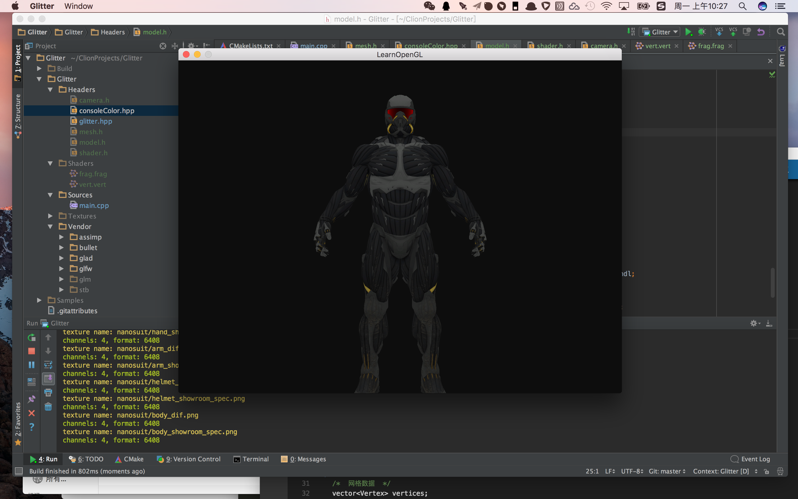
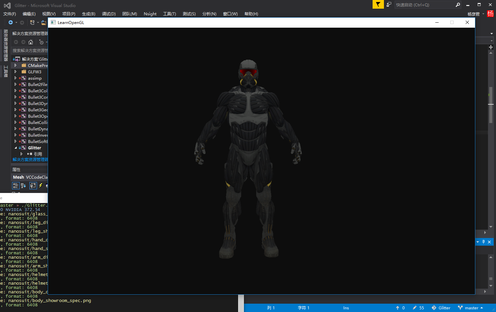

# learnopengl-glitter
[learnopengl](http://www.learnopengl.com/) source code - [Glitter](https://github.com/Polytonic/Glitter) version

[learnopengl](https://learnopengl-cn.github.io/) 源代码 - [Glitter](https://github.com/Polytonic/Glitter) 实现

## Glitter版和LearnOpenGL源代码的区别以及Glitter本身一些注意事项

1. 使用glad获取opengl函数

```c++
// Load OpenGL Functions
gladLoadGL();
std::cout << "OpenGL " << glGetString(GL_VERSION) << std::endl;
```

2. 使用stb读取图片

```c++
#define STB_IMAGE_IMPLEMENTATION
int width, height;
unsigned char* image = stbi_load("wall.jpg", &width, &height, 0, 0);
stbi_image_free(image);
```

3. 在mac上强制glfw使用版本向前兼容

```c++
// Mac 10.9以后OpenGL版本为祖传OpenGL4.1，不能改变
// 如果使用3.3或以下版本，需要兼容
glfwWindowHint(GLFW_OPENGL_FORWARD_COMPAT, GL_TRUE);
```

4. 在retina屏上设置viewport只占屏幕1/4

```c++
// 直接设置窗口分辨率是retina拉伸后的
// 而设置viewport的尺寸是retina拉伸前的
// 从帧缓冲中获取viewport尺寸是正确做法
int width, height;
glfwGetFramebufferSize(window, &width, &height);
glViewport(0, 0, width, height);
```

## mac demo


## win demo

